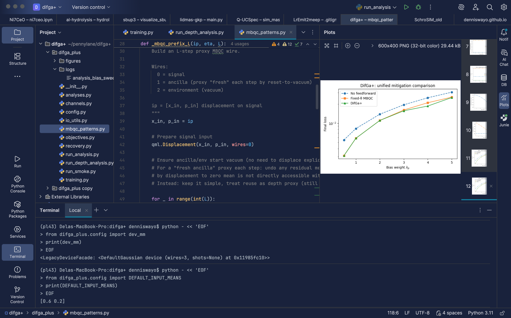

<h1>Publications</h1>

  <button class="filter-button active" data-filter="all">All</button>
  <button class="filter-button" data-filter="quantum-computing">Quantum Computing</button>
  <button class="filter-button" data-filter="photonics">Photonic QC</button>
  <button class="filter-button" data-filter="quantum-simulation">Quantum Simulation</button>
  <button class="filter-button" data-filter="quantum-error-mitigation">Error Mitigation</button>
  <button class="filter-button" data-filter="quantum-software">Quantum Software</button>

  

    arXiv Preprint
    
<strong>Linear optics to scalable photonic quantum computing</strong>

    
<a class="date" href="https://arxiv.org/abs/2501.02513">2025</a>

  

  

    arXiv Preprint
    
<strong>Gaussian models to non-Gaussian realms of quantum photonic simulators</strong>

    
<a class="date" href="https://arxiv.org/abs/2502.05245">2025</a>

  

  

    TechRxiv
    
<strong>SchroSIM: A Schrödinger-Inspired Scalable Quantum Photonic Circuit Simulator for Hardware-Agnostic Quantum Computing</strong>

    
<a class="date" href="https://github.com/DennisWayo/SchroSIM">2025</a>

  

  

    arXiv Preprint
    
<strong>DifGa: Differentiable Error Mitigation for Multi-Mode Gaussian and Non-Gaussian Noise in Quantum Photonic Circuits</strong>

    
<a class="date" href="https://arxiv.org/abs/2512.23776">2025</a>

  

