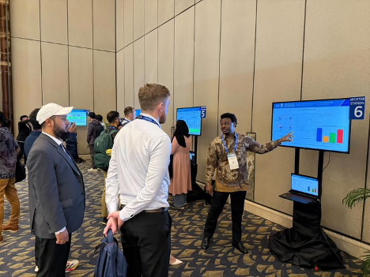

### 1. APOGCE 2025 – Jakarta, Indonesia  
**Presentation:** *Quantum-AI Toolkit for Predicting Wellbore Additive Stability*

<p align="center">
  
</p>

We just wrapped up an exciting and productive session at the **Asia Pacific Oil & Gas Conference and Exhibition (APOGCE) 2025** in Jakarta!

Inspired by the simplicity of a pregnancy test—where a single drop reveals vital information—we are developing a **Quantum-AI Toolkit** designed to predict whether chemical additives (e.g., EDTA–metal complexes) will remain stable under real-world wellbore conditions.

Think of it as a field-deployable screening method for evaluating the effectiveness of filter cake breakers **before costly field deployment**, seamlessly bridging simulation with operational decision-making.

Engaging discussions with **@Pertamina**, **@Sinomine Speciality Fluids**, and **@Archer Well** reaffirmed the importance of **collaboration between industry and academia** to drive innovation in the energy sector.

---
**Tags:**  
#QuantumAI #DFT #TDDFT #GPAW #FilterCakeBreakers #WellboreStability #EnergyInnovation #SPE #APOGCE2025 #Jakarta

**Cite:**
```bash
@inproceedings{irawan2025uv,
  title={UV-Vis Optical Spectra Modeling for Analyzing Filter Cake Breaker Stability Using First-Principles Density Functional Theory},
  author={Irawan, S and Wayo, DDK and Juziyeva, S and Fathaddin, MT and Goliatt, L},
  booktitle={SPE Asia Pacific Oil and Gas Conference and Exhibition},
  pages={D021S012R012},
  year={2025},
  organization={SPE}
}
```